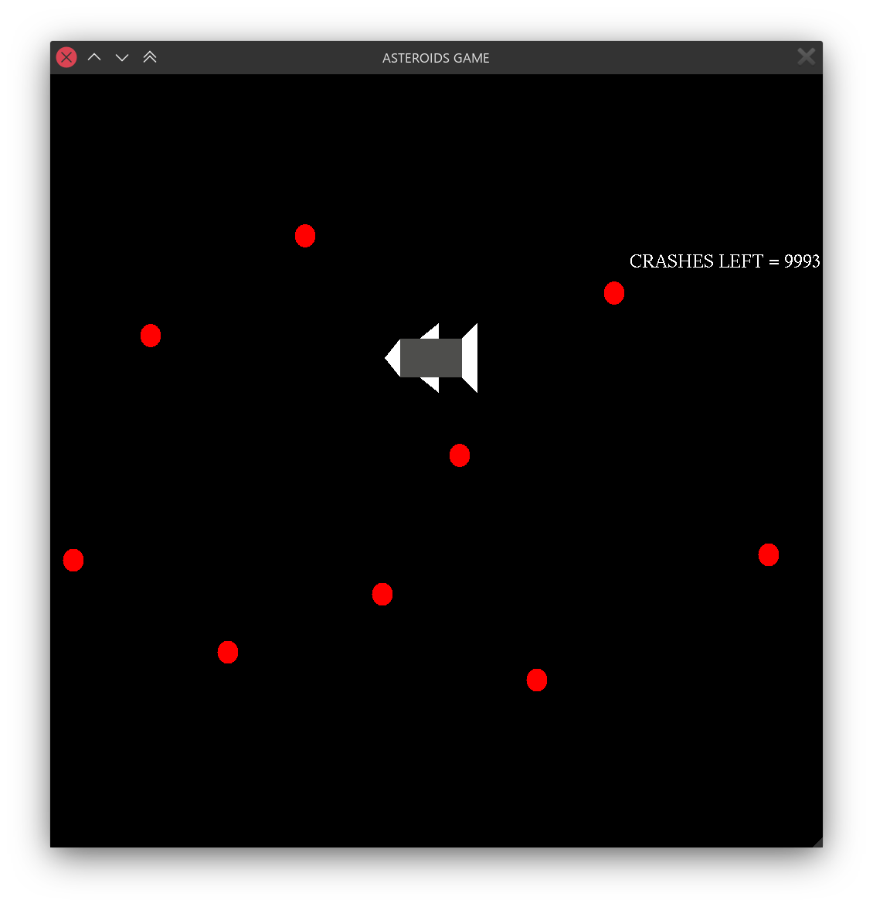

# Asteroids Game

> TUSHAR PANDEY
> 1BY18CS180
> 6SEM CSE 2022

## Features
* Uses GLUT, GLEW.
* Compiled with GCC using `-lglut -lGL -lGLU -lGLEW`
* Collision detection
* Variable movement speed by handling keypress events


## Usage

#### Clone and build:
```bash
git clone "https://github.com/tusharpandey13/cgproject.git"
cd cgproject
make && chmod +x ./main
```
#### Running:
```bash
./main
```


